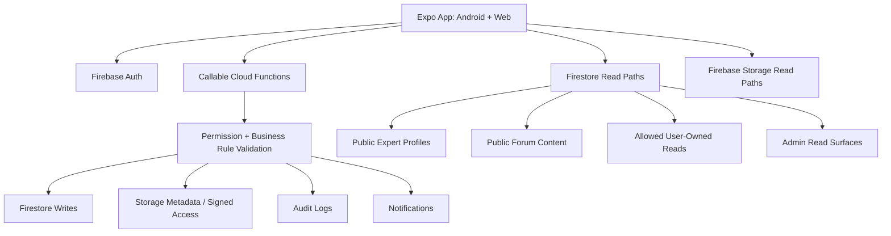

# ReMind Architecture

> **Note:** The Firebase-first architecture described below is now considered **legacy**. The project has migrated to a Node.js API backend structure using Express.js/Fastify and MongoDB.
> 
> **New Backend Architecture (Node.js API):**
> - **Location:** `apps/api/` (Express.js + TypeScript).
> - **Core Directory Structure:**
>   - `src/routes`: API route definitions.
>   - `src/controllers`: Request handling and business logic.
>   - `src/middlewares`: Authentication and role checks (e.g., `requireAuth`, `requireRole('admin')`).
>   - `src/config/db.ts`: MongoDB connection setup.
> - **Admin MVP Routes:** Expert approval/rejection (`/api/admin/experts/*`) and moderation (`/api/admin/reports/*`).
> - **Database:** MongoDB (using Mongoose or native driver).
> - **Authentication:** JWT with short-lived access tokens and refresh-token rotation.

## Legacy Architecture Decision

ReMind MVP initially used a Firebase-first architecture with one Expo application for both Android and Web.

The frontend is read-only against Firestore. Every create, update, and delete operation goes through Firebase Cloud Functions written in TypeScript. Cloud Functions validate permissions, enforce business rules, write Firestore/Storage, and create logs or notifications.

There is no separate Node.js API server for the MVP. Cloud Functions are the backend boundary.

## Goals

- Ship Android and Web quickly from one app codebase.
- Keep mental-health and expert credential data protected.
- Avoid client-side business-rule bypasses.
- Make guest expert search and forum browsing fast to deploy.
- Keep the architecture ready for future booking, payments, calls, and organization features.

## MVP Actors

- `guest`: unauthenticated visitor who can search experts and browse/search public forum content.
- `student`: signed-in user receiving support and participating in forums.
- `expert`: signed-in psychological expert who submits onboarding data and participates in forums.
- `admin`: platform operator who approves experts, moderates forum content, and handles reports.

Future actors, not MVP:

- `organization_manager`
- `system_manager`
- advanced organization membership/credit flows

## System Layout



## Codebase Shape

Recommended structure:

```text
apps/
  remind/
    # Expo + React Native + TypeScript
    # targets Android and Web

functions/
  src/
    # Firebase Cloud Functions + TypeScript

packages/
  shared/
    # shared types, validation schemas, constants, API/function client helpers
```

If the project stays small at first, this can start simpler:

```text
app/
  # Expo app

functions/
  # Cloud Functions

shared/
  # shared TypeScript types and schemas
```

## Frontend

Technology:

- Expo
- React Native
- React Native Web
- TypeScript
- Expo Router
- Firebase client SDK

Frontend responsibilities:

- Render Android and Web UI.
- Sign users in and out through Firebase Auth.
- Read allowed Firestore documents.
- Upload files only through approved flows.
- Call Cloud Functions for every write.
- Never decide sensitive permissions locally.

Frontend must not directly write Firestore documents for MVP.

## Backend

Technology:

- Firebase Cloud Functions
- TypeScript
- Firebase Admin SDK
- Firestore
- Firebase Storage

Backend responsibilities:

- Validate authentication and roles.
- Validate input using shared schemas.
- Enforce business rules.
- Write Firestore documents.
- Create audit logs for sensitive actions.
- Create notifications.
- Manage sensitive file metadata/access.
- Keep writes idempotent where retry or double-submit risk exists.

## Firestore Access Model

Default rule posture:

```js
match /databases/{database}/documents {
  match /{document=**} {
    allow read: if false;
    allow write: if false;
  }
}
```

Add narrow read rules only for approved read models:

- Guests can read approved public expert profiles.
- Guests can read active public forum content.
- Signed-in users can read their own safe profile data.
- Students and experts can read forum group discussions they are allowed to access.
- Users can read their own notifications.
- Admins can read admin surfaces when their role/status allows it.

All writes go through Cloud Functions.

## Data Boundary Rules

Firestore rules cannot hide fields inside a readable document. Therefore:

- Public expert data must be stored separately from private expert credential/review data.
- Public forum data must not include private author identity when anonymous display is used.
- User documents must not be made broadly readable if they contain mixed private fields.
- Sensitive files must not use public download URLs.
- Admin review notes, credential files, reports, logs, and private user data are backend-filtered only.

## MVP Feature Architecture

### Auth And Roles

Cloud Functions own profile creation/update flows that affect protected fields. The client can read allowed own profile data but cannot write role, status, permissions, review fields, or audit fields.

### Guest Expert Search

Use a public expert profile read model containing only approved public fields. Expert onboarding data, credential files, license numbers, admin review data, and private account fields stay in private documents.

### Expert Onboarding

Experts submit onboarding through Cloud Functions. Admin approval/rejection also goes through Cloud Functions. Approval publishes or updates the public expert profile read model.

### Forum Browse And Search

Guests can read active public forum categories, posts, comments, and group discussion summaries. Hidden, removed, pending-review, private, or banned content is excluded from guest reads.

### Forum Group Discussions

Group chat is part of the forum domain, not a separate standalone chat system in MVP. Students and experts can join and participate. Guests can browse/search public discussion content but cannot join or post.

### Reports And Moderation

Reports are created through Cloud Functions. Admin moderation actions are Cloud Functions. Every sensitive action creates an audit log.

### Notifications

Notifications are backend-created and owner-readable only. Clients cannot create arbitrary notifications.

## Cloud Function Groups

Suggested function groups:

- `authProfile.*`: create/update safe profile data.
- `expertOnboarding.*`: submit onboarding, upload metadata, request review.
- `adminExperts.*`: approve/reject/suspend experts.
- `forum.*`: create post, create comment, join group discussion, create group message.
- `moderation.*`: hide/remove/restore content, restrict user.
- `reports.*`: submit report, review report, resolve report.
- `notifications.*`: mark read/archive notification.
- `files.*`: create upload intent, create signed access for sensitive files.

## Fastest Deploy Order

1. Expo Android/Web app shell.
2. Firebase Auth and MVP roles.
3. Public expert profile read model and guest expert search.
4. Expert onboarding and admin approval.
5. Public forum browse/search.
6. Student/expert forum posts and comments.
7. Forum group discussions.
8. Reports and admin moderation.
9. MVP notifications.

## Future Features

Defer these until the MVP proves the core flow:

- Appointment booking.
- Payment, subscriptions, credits, refunds, and payouts.
- Face-to-face meeting scheduling.
- Voice/video calls.
- AI risk/crisis escalation.
- Organization manager, organization subscriptions, join codes, and pooled credits.
- Advanced system-manager/admin-permission hierarchy.

## Testing Strategy

Minimum required tests:

- Firestore rule tests for allowed reads and denied writes.
- Cloud Function tests for permission checks and business rules.
- Integration tests for expert onboarding -> admin approval -> public expert profile.
- Integration tests for forum post/comment/group discussion flows.
- Moderation tests for report review, hidden/removed content, and audit logs.
- Notification tests for owner-only reads and backend-only creation.

Good tests verify externally visible behavior: who can do what, what data is visible, what state changes happen, and what logs/notifications are produced.

## Non-Negotiable Constraints

- Frontend does not write Firestore directly.
- Sensitive writes always go through Cloud Functions.
- Public documents contain only public fields.
- Private documents are never exposed through public read rules.
- Admin actions are logged.
- Organization, call, payment, and booking systems do not block the first deploy.
